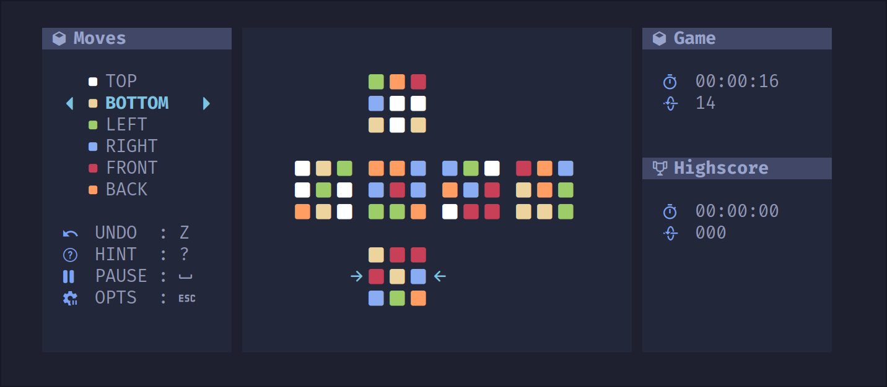

<br/>
<div align="center">
  
</div>
<br/>

A collection of terminal based mini-games, written in python. 

## Contents

- [Features](#features)
  - [Rubik's Cube Puzzle]()
  - [Klondike Solitaire](#klondike-solitaire )
- [Installation](#installation)
  - [Prerequisites](#prerequisites)
  - [Homebrew](#homebrew)
  - [AUR](#aur)
  - [Windows]()
  - [Manual Installation](#manual-installation)
- [Configuration](#configuration)
  - [Colorschemes](#colorschemes)
  - [Ascii-banners](#ascii-banners)

## Features

### Klondike Solitaire


### Rubik's Cube Puzzle

Become a master of the terminal based Rubik's cube. The game will track the number of performed moves of the cube, as well as the time used for a valid solution.

<div align="center">
  
</div>

### Game statistics

Keeps track of the number of moves used to solve the cube, and the time spent getting a valid solution. The results are saved, encouraging you to beat your fastest time.


## Installation

### Prerequisites

This appllication requires having a nerd font installed on your system and set in the terminal emulator being used to run the application. Nerd fonts can be downloaded from [www.nerdfont.com](https://nerdfont.com). 

### Homebrew


### AUR


```bash
# using paru
paru -S rubiks-tui

# using yay
yay -S rubiks-tui
```

### Build from source (Arch)

```bash
git clone https://github.com/FLIVLA/rubiks-tui.git
cd rubiks-tui
makepkg -si
```

### Manual Installation

Clone the repository and install the application using the `setup.py`:

```bash
git clone https://github.com/FLIVLA/rubiks-tui.git
cd rubiks-tui
python setup.py install
```

## Configuration

### Application Settings

The application saves your preferences in the `.toml` configuration file that comes with the application. Preferences are saved and takes effect while changing. Comes with a variety of different color schemes, placed in the application configuration folder.

<br/>
<div align="center">
  
</div>
<br/>

The application gets color themes from the application config directory:

- **Linux** - ~/.config/games-tui/colorschemes/
- **MacOS** - ~/.something/.../games-tui/colorschemes/
- **Windows** - C:\Users\your_username\something\...\games-tui\colorschemes

To add your own color themes, the toml template below can be used as a starting point. The application supports both RGB, and hex color codes.

```toml
[base_colors]
white = ""
yellow = ""
green = ""
blue = ""
red = ""
orange = ""

[ui_colors]
window_background = ""
header_background = ""
header_text = ""
ui_text = ""
ui_text_selected = ""
ascii_title = ""
icons = ""

[game_colors]
card_frames = ""
card_selected_frame = ""
```