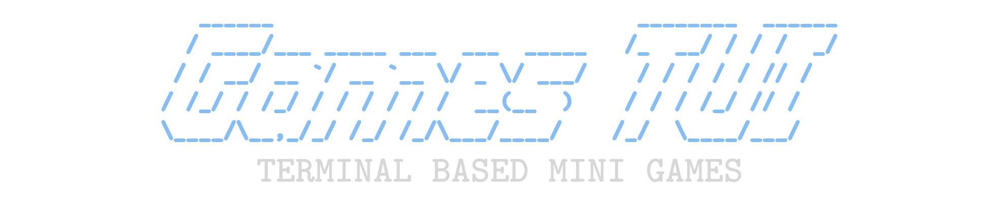

<br/>
<div align="center">
  
</div>
<br/>
<br/>

A Rubik's cube game client for the terminal.

## Contents

1. [Installation](#installation)
3. [Configuration](#configuration)

## Installation

### Homebrew

### AUR

```bash
# using paru
paru -S rubiks-tui

# using yay
yay -S rubiks-tui
```

### Build from source (Arch)

```bash
git clone https://github.com/FLIVLA/rubiks-tui.git
cd rubiks-tui
makepkg -si
```

### Manual Installation

Clone the repository and install the application using the `setup.py`:

```bash
git clone https://github.com/FLIVLA/rubiks-tui.git
cd rubiks-tui
python setup.py install
```


## Configuration

Configuration files will be placed in the applications config directory

- **Linux**: ~/.config/rubiks-tui/config.toml
- **MacOS**:

Example configuration can be found [Here]("")

Following is the default configuration file:

```toml
# ------------------------ UI Display --------------------------
# Display options for the UI. Note that for custom ascii banners,
# there is a max y,x of y,x characters of the 
# 

[ui_display]
show_background = "true"  # set to false for transparent window background
show_headers = "true"     # display of sidepane headers
show_ui_borders = "false" # display of borders around windows
color_scheme = "default"  # name of the colorscheme (filename wo. extension)
ascii_banner = "default"  # ascii banner displayed on the start screen

# ----------------------- KEYBINDINGS --------------------------
# Navigation:
#   Default navigation: arrow keys 
#   Default alt navigation: are set to vim keybindings (h,j,k,l)
#
# Cube rotation:
#   Clockwise rotation: arrow key (right)
#   Counter clockwise rotation: arrow key (left)
#   Alt clockwise rotation: vim key (l)
#   Alt counter clockwise rotation: vim key (h)

[keybindings]
nav_left = "arw"                    # navigate left
nav_right = "arw"                   # navigate right
nav_up = "arw"                      # navigate up
nav_down = "arw"                    # navigate down 
rotate_clockwise = "arw"            # clockwise cube rotation
rotate_counter_clockwise = "arw"    # counter clockwise cube rotation
alt_nav_left = "h"                  # alt navigate left
alt_nav_right = "l"                 # alt navigate right
alt_nav_up = "k"                    # alt navgate down
alt_nav_down = "j"                  # alt navgate up
alt_rotate_clockwise = "h"          # alt clockwise cube rotation
alt_rotate_counter_clockwise = "l"  # alt counter clockwise cube rotation

# TODO:
# maybe implement custom shortcut bindings for the different moves.
```

### Colorschemes

Colorschemes are defined in `.toml` files separate from the main configuration file described in the precious section, to enable storing multiple colorschemes, and switching between them. By default the application ships with four pre-defined colorschemes:

- [default]()
- [catppuccin]()
- [gruvbox]()
- [tokyonight]()

Colorschemes are stored in a subdirectory to the application's config directory in:


The following example shows the necessary color definitions necessary for creating a custom colorscheme:

```toml
# ---------------------------- WINDOW --------------------
[window]
window_background = "rgb(24, 25, 38)"     # background colors of ui windows
side_pane_background = "rgb(24, 25, 38)"
icon_color = "rgb(138, 173, 244)"         # UI icon foreground color

[header]
header_background = ""
header_text = ""

[text]
ui_text = ""
ui_selected_text = "rgb(125, 196, 228)"   # selected text color
ascii_title = ""

[cube]
cube_top = "rgb(202, 211, 245)"     # tup cube face color (default: white)
cube_bottom = "rgb(238, 212, 159)"  # bottom cube face color (default: yellow)
cube_left = "rgb(166, 218, 149)"    # left cube face color (default: green)
cube_right = "rgb(138, 173, 244)"   # right cube face color (default: blue)
cube_front = "rgb(237, 135, 150)"   # front cube face color (default: red)
cube_back = "rgb(245, 169, 127)"    # back cube face color (default: orange)
```

**NOTE:** The application currently does not support hex-colors in these colorschemes.


